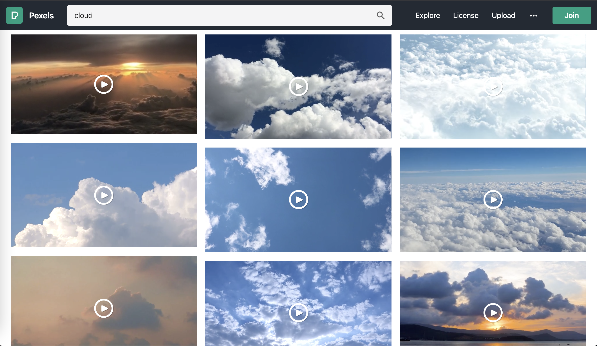
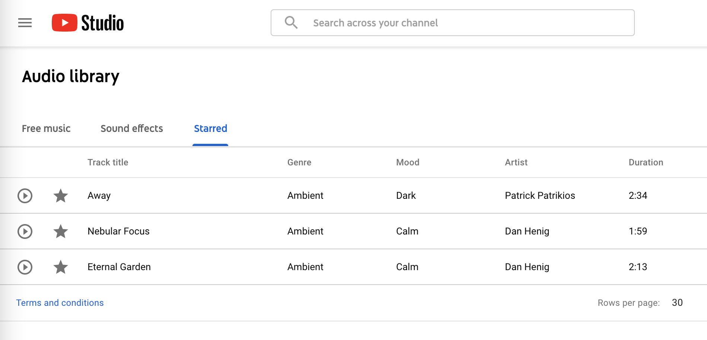
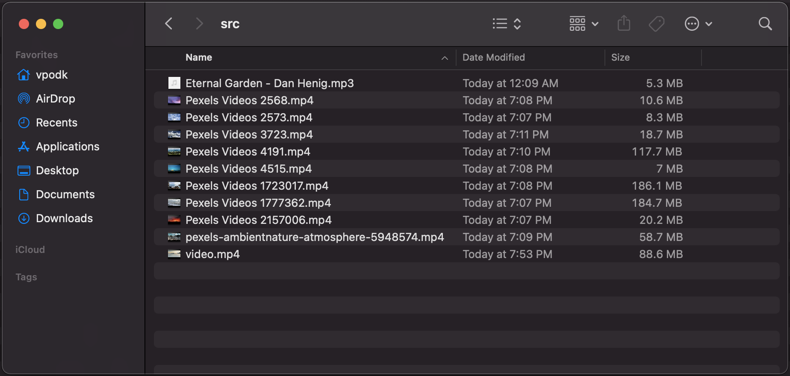

# Gluer

This program makes it easy to create great videos by combining random chunks from other videos.

## Prerequisite
To build and run this application, you will need the following tools:

- [python](https://www.python.org/downloads/) - Python is an interpreted, high-level and general-purpose programming language.
- [ffpmeg](https://ffmpeg.org/download.html) - A complete, cross-platform solution to record, convert and stream audio and video.
  - Ubuntu: `sudo apt install ffmpeg`
  - macOS: `brew install ffmpeg`


## Usage
```bash
usage: gluer [-h] [-output path] input

positional arguments:
  input         The path to the folder with video and audio files.

optional arguments:
  -h, --help    show this help message and exit
  -output path  The path to the output file (default: output.mp4).
```

## Example
Get 5 videos from [Pexels](https://www.pexels.com/search/videos/cloud/):


Get 1 audio from [YouTube Audio Library](https://youtube.com/audiolibrary):


Put all of them to the same folder (e.g. `/tmp/src`):


Run `./gluer -output /tmp/output.mp4 /tmp/src`

